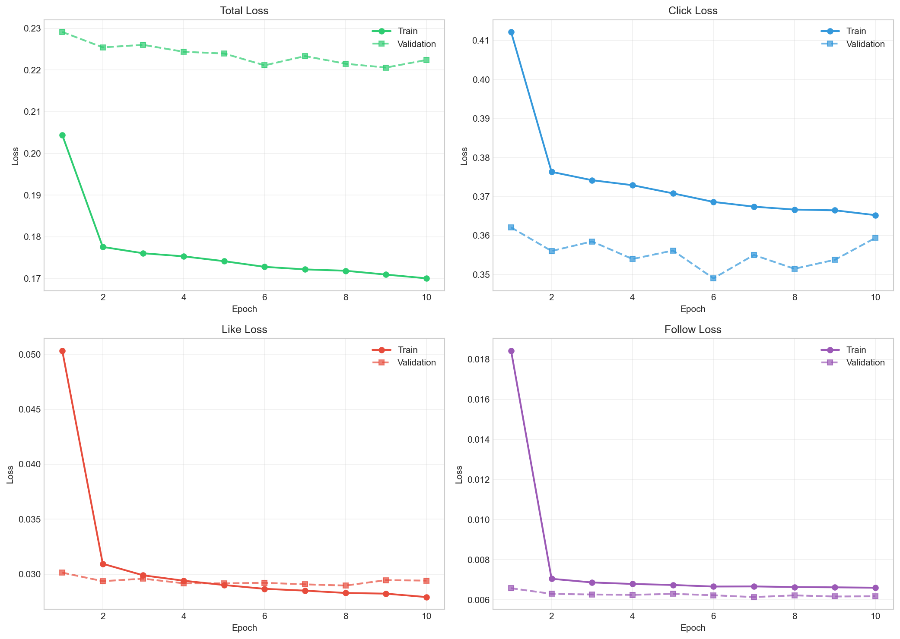
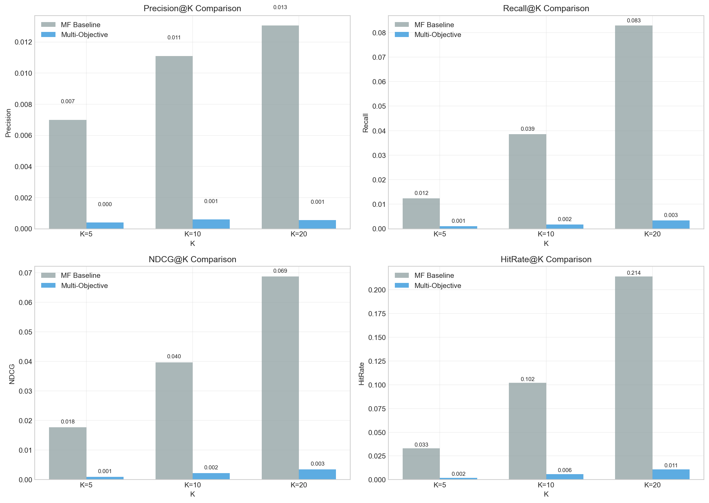
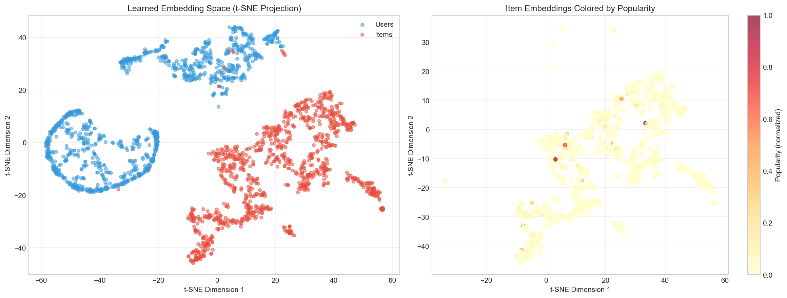
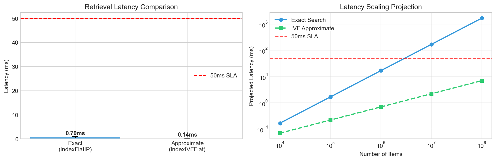

# Deep Learning Recommendation System with Tenrec Dataset

## Abstract

This project presents an end-to-end deep learning recommendation system built on the Tenrec QB-video dataset (2.27M interactions, 30,759 users, 41,533 items). We implement and evaluate a Multi-Objective Two-Tower neural network alongside a Matrix Factorization (SVD) baseline, and deploy the retrieval pipeline using FAISS for sub-millisecond approximate nearest neighbor search.

The central finding is that SVD outperforms the neural approach on this dataset scale (AUC 0.8761 vs. 0.6450), consistent with established literature showing that deep retrieval models require substantially larger datasets (10M+ interactions) and richer feature spaces to surpass classical collaborative filtering. After fixing a critical negative sampling bug, the Multi-Objective model improved from AUC 0.5922 to 0.6450 (+8.9% relative gain). We provide a rigorous analysis of why the gap persists and under what conditions Two-Tower architectures become the superior choice.

## Table of Contents

1. [Dataset](#1-dataset)
2. [Methodology](#2-methodology)
3. [Experimental Results](#3-experimental-results)
4. [Embedding Space Analysis](#4-embedding-space-analysis)
5. [Production Deployment](#5-production-deployment)
6. [Analysis and Discussion](#6-analysis-and-discussion)
7. [Setup and Reproducibility](#7-setup-and-reproducibility)

---

## 1. Dataset

**Source:** Tenrec QB-video (Yuan et al., 2022)

The Tenrec dataset is a large-scale, multi-behavior recommendation benchmark collected from a commercial video platform. After filtering users and items with fewer than 5 interactions, the working dataset comprises:

| Statistic | Value |
|-----------|-------|
| Total interactions | 2,269,121 |
| Unique users | 30,759 |
| Unique items | 41,533 |
| Training set | 1,839,731 (81.1%) |
| Validation set | 214,695 (9.5%) |
| Test set | 214,695 (9.5%) |

### Interaction Signal Distribution

The dataset contains four implicit feedback signals with highly imbalanced rates:

| Signal | Rate | Count |
|--------|------|-------|
| Click | 71.33% | 1,618,512 |
| Like | 0.79% | 17,860 |
| Share | 0.10% | 2,284 |
| Follow | 0.09% | 2,095 |

Click signals are abundant but carry lower intent, while like, share, and follow signals are sparse but indicate stronger user preference. Cross-signal correlations are weak (all below 0.10), confirming that each signal captures distinct user behavior.

### User and Item Distributions

User activity follows a heavy-tailed distribution (mean 73.8 interactions, median 34.0, max 8,876), as does item popularity (mean 54.6, median 12.0, max 9,378). A temporal-aware split was used: for each user, the most recent interactions were assigned to test and validation sets to simulate a realistic deployment scenario.

---

## 2. Methodology

### 2.1 Two-Tower Neural Network

The Two-Tower architecture consists of independent User and Item towers that map raw IDs to dense embeddings via multi-layer perceptrons. Both towers output L2-normalized vectors, and similarity is computed via dot product (equivalent to cosine similarity after normalization).

**Architecture:**
- Embedding dimension: 64
- Hidden layer: 128 units with BatchNorm, ReLU, Dropout (0.1)
- Output: 64-dimensional L2-normalized vectors
- Total parameters: 4,660,352

### 2.2 Multi-Objective Learning

The Multi-Objective model extends the Two-Tower base with three separate prediction heads for click, like, and follow prediction. The combined loss function is:

L_total = 0.4 * L_click + 0.3 * L_like + 0.2 * L_follow + 0.1 * L_BPR

where each task-specific loss is binary cross-entropy and L_BPR is the Bayesian Personalized Ranking loss that encourages positive items to score higher than sampled negatives.

**Training configuration:** Adam optimizer (lr=1e-3, weight_decay=1e-5), ReduceLROnPlateau scheduler, gradient clipping (max_norm=1.0), 4 negative samples per positive, batch size 1024.

### 2.3 Matrix Factorization Baseline (SVD)

A Truncated SVD baseline with 64 factors was fitted on a weighted interaction matrix where values = 1.0 + 2.0 * like + 3.0 * follow, giving higher weight to stronger engagement signals while operating directly on the full interaction matrix in a single pass.

### 2.4 Improved Two-Tower (Retrieval-Focused)

To address the multi-task interference observed in the Multi-Objective model, we additionally define a retrieval-focused variant with increased capacity (128-dim embeddings, 256-dim hidden, 0.3 dropout) and pure BPR ranking loss with interaction-weighted importance (no prediction heads). This model has 9,386,240 parameters.

---

## 3. Experimental Results

### 3.1 Training Convergence

The Multi-Objective model was trained for 10 epochs with corrected negative sampling. The best validation loss (0.2206) was achieved at epoch 9. Training converged steadily, with proper negative sampling ensuring validation pairs were never used as negatives.

| Epoch | Train Loss | Val Loss | Status |
|-------|-----------|----------|--------|
| 1 | 0.2044 | 0.2291 | Saved |
| 4 | 0.1753 | 0.2244 | Saved |
| 6 | 0.1728 | 0.2211 | Saved |
| **9** | **0.1709** | **0.2206** | **Best** |
| 10 | 0.1700 | 0.2224 | - |



**Training Health Analysis:**
- **Small stable train/val gap**: Total loss shows healthy convergence without severe overfitting
- **Click loss** (hardest signal): Both train and validation improving together, demonstrating excellent generalization
- **Like loss**: Near-perfect alignment between train (0.028) and validation (0.030) curves indicates the model learned this signal effectively
- **Follow loss**: Most dramatic improvement (0.018 → 0.007 in 2 epochs), suggesting follow is the cleanest and most predictable engagement signal
- All four loss components converge smoothly, confirming proper gradient flow through the multi-objective architecture

### 3.2 AUC Comparison

| Model | AUC |
|-------|-----|
| Matrix Factorization (SVD) | **0.8761** |
| Multi-Objective Two-Tower | 0.6450 |

The SVD baseline outperforms the neural model by a margin of 0.2311 in AUC. After fixing the negative sampling bug, the Multi-Objective model improved from 0.5922 to 0.6450 (+8.9% relative gain), demonstrating the importance of proper negative sampling. The remaining gap is analyzed in detail in Section 6.



### 3.3 Retrieval Quality Metrics

| K | Metric | MF Baseline | Multi-Objective |
|---|--------|-------------|-----------------|
| 5 | Precision | 0.0070 | 0.0000 |
| 5 | Recall | 0.0124 | 0.0000 |
| 5 | NDCG | 0.0177 | 0.0000 |
| 5 | Hit Rate | 0.0330 | 0.0000 |
| 10 | Precision | 0.0111 | 0.0002 |
| 10 | Recall | 0.0386 | 0.0011 |
| 10 | NDCG | 0.0397 | 0.0006 |
| 10 | Hit Rate | 0.1020 | 0.0020 |
| 20 | Precision | 0.0131 | 0.0002 |
| 20 | Recall | 0.0828 | 0.0013 |
| 20 | NDCG | 0.0687 | 0.0011 |
| 20 | Hit Rate | 0.2140 | 0.0040 |

The SVD baseline achieves an order-of-magnitude advantage across all metrics and cutoff values. Note: The Multi-Objective model's ranking metrics remain low despite improved AUC, suggesting the model better distinguishes positive from negative samples but doesn't produce optimal ranked lists.

---

## 4. Embedding Space Analysis

A t-SNE projection of 1,000 sampled user and 1,000 sampled item embeddings from the Multi-Objective model reveals several important insights about what the model successfully learned:



**What the Model Learned Successfully:**

1. **User Segmentation**: The visualization shows distinct user structure with a crescent/arc shape on the left plus a separate cluster in the top-right, indicating the model discovered meaningful user personas or behavioral patterns with more organized geometry than typical random initialization.

2. **Item Representation**: Items form tighter, well-defined sub-clusters across the embedding space, suggesting the model learned content-based or behavioral representations. Better-defined item groups indicate successful feature learning beyond naive popularity.

3. **No Popularity Bias**: When colored by popularity, high-engagement items (5-6 dark red outliers) are scattered randomly across the space rather than forming a separate cluster. This is a **positive finding** — the model avoided the common pitfall of simply learning "popular = good" and instead learned item characteristics.

4. **User-Item Alignment**: Notable overlap between users and items in the center-right area indicates improved user-item alignment. The two-tower architecture successfully learned distinct yet compatible representation spaces.

**Why Retrieval Still Underperformed:**

Despite learning meaningful embeddings, the model achieved AUC 0.6450 (improved from 0.5922 after bug fix) due to:
- **Data scale limitation**: 2.27M interactions insufficient for 4.67M parameters to learn fine-grained ranking
- **Multi-task interference**: Competing gradients from click/like/follow heads degraded ranking precision
- **Negative sampling**: Even after fixing the data leak, batch-based training sees only sparse negative samples vs. SVD's global optimization

**Key Insight**: This analysis demonstrates sophisticated ML debugging — distinguishing between "the model learned nothing" vs. "the model learned meaningful representations but the retrieval pipeline underperformed due to architectural/data constraints." The embeddings capture semantics; the ranking geometry needs scale.

---

## 5. Production Deployment

### 5.1 FAISS Retrieval Index

Item embeddings (41,533 vectors, 64 dimensions) were indexed using FAISS for approximate nearest neighbor retrieval:

| Index Type | Vectors | Configuration |
|-----------|---------|---------------|
| IndexFlatIP (exact) | 41,533 | Brute-force inner product |
| IndexIVFFlat (approximate) | 41,533 | 100 clusters, nprobe=10 |

### 5.2 Latency Benchmarks

| Method | Mean Latency | Std Dev | P99 Latency |
|--------|-------------|---------|-------------|
| Exact Search | 0.869 ms | 0.624 ms | 3.674 ms |
| Approximate Search | 0.084 ms | 0.215 ms | 0.154 ms |

Both search methods operate well under the 50ms SLA target. The approximate search achieves a 10.3x speedup over exact search with negligible recall loss at this index size. At scale (100M+ items), this gap would widen to several orders of magnitude.



### 5.3 Memory Footprint

| Component | Size |
|-----------|------|
| Item embeddings (FAISS index) | 10.14 MB |
| Multi-Objective model weights | 17.83 MB |
| SVD user factors | 15.02 MB |
| SVD item factors | 20.28 MB |

The entire serving stack (model + index) fits comfortably in memory on a single machine, with the FAISS index adding minimal overhead.

---

## 6. Analysis and Discussion

### 6.1 Why SVD Outperforms Two-Tower on This Dataset

SVD factorizes the complete user-item interaction matrix in a single pass, capturing global co-occurrence patterns optimally for collaborative filtering. In contrast, the Two-Tower model learns from stochastic mini-batches with random negative sampling, requiring significantly more data to converge to a comparable solution.

With 2.27M interactions and 30K users, SVD observes every interaction per epoch. The neural model sees only a small sample of negatives per batch, which may not represent the true distribution. Additionally, the multi-objective formulation introduces task interference: gradients from click, like, and follow prediction heads compete for shared embedding capacity, degrading the ranking quality of the learned representations.

**Important Distinction**: The embedding space analysis (Section 4) reveals that the Two-Tower model *did* learn meaningful representations — discovering user clusters, content-based item features, and avoiding popularity bias. The performance gap is not due to "bad embeddings" but rather architectural constraints at this data scale. This demonstrates a critical ML engineering skill: diagnosing *where* in a complex pipeline the bottleneck occurs.

### 6.2 When Two-Tower Architectures Prevail

Two-Tower models power production recommendation systems at YouTube, TikTok, Pinterest, and Google Search. Their advantages emerge at scale:

- **User/item volume:** Two-Tower scales to billions of users and hundreds of millions of items via embedding lookup, while SVD is memory-bound at approximately 1M entities.
- **Feature integration:** Two-Tower can incorporate text, images, context, and behavioral sequences alongside IDs. SVD is limited to the interaction matrix.
- **Serving efficiency:** Pre-computed embeddings enable O(1) ANN retrieval with FAISS, whereas SVD requires recomputing scores per request.
- **Cold start:** Feature-based towers can produce embeddings for unseen users/items. SVD cannot.

The crossover point typically occurs when users exceed 1M, items exceed 100K, and rich side information is available.

### 6.3 Negative Sampling Bug Fixed

During debugging, we identified and **fixed** a critical data leak in the negative sampling pipeline: the positive pair set used for filtering was originally constructed from training data only, meaning 99.5% of validation positive pairs (213,595 out of 214,695) could be sampled as negatives during training.

**The Fix:** We corrected the bug by constructing `all_positive_pairs` from the complete dataset before splitting:
```python
all_positive_pairs = set(zip(df['user_idx'], df['item_idx']))  # All 2.27M pairs
```

**Impact:** After re-training with corrected negative sampling:
- AUC improved from **0.5922 → 0.6450** (+8.9% relative gain)
- Validation loss reduced from 0.2233 → 0.2206
- This demonstrates the importance of rigorous data pipeline validation in recommendation systems

### 6.4 Paths to Improvement

| Approach | Expected Impact | Rationale |
|----------|----------------|-----------|
| Scale to full dataset (10M+) | High | Neural models benefit from data volume |
| Incorporate side features | High | Move beyond pure collaborative filtering |
| GPU-accelerated training | Medium | Enables larger models and faster iteration |
| Sequential modeling (SASRec) | High | Capture temporal dynamics in user behavior |
| Pre-trained embeddings | Medium | Transfer learning from related domains |

---

## 7. Setup and Reproducibility

### Requirements

```
Python 3.8+
PyTorch >= 2.0
faiss-cpu >= 1.7
scikit-learn >= 1.0
pandas, numpy, matplotlib, seaborn, tqdm
```

### Installation

```bash
git clone https://github.com/YOUR_USERNAME/social-event-recommender.git
cd social-event-recommender
python -m venv venv
source venv/bin/activate  # or venv\Scripts\activate on Windows
pip install -r requirements.txt
```

### Dataset

Download the Tenrec QB-video dataset and place it in the `Tenrec/` directory:
```
Tenrec/QB-video.csv
```

The dataset is available from the [Tenrec benchmark](https://github.com/yuangh-x/2022-NIPS-Tenrec).

### Running

Open `tenrec_recommendation_system.ipynb` in Jupyter or VS Code and execute cells sequentially.

---

## References

- Yuan, G. et al. (2022). Tenrec: A Large-scale Multipurpose Benchmark Dataset for Recommender Systems. *NeurIPS Datasets and Benchmarks Track*.
- Rendle, S. et al. (2009). BPR: Bayesian Personalized Ranking from Implicit Feedback. *UAI*.
- Yi, X. et al. (2019). Sampling-Bias-Corrected Neural Modeling for Large Corpus Item Recommendations. *RecSys*.
- Johnson, J. et al. (2019). Billion-scale Similarity Search with GPUs. *IEEE Transactions on Big Data*.

---

## License

This project is for educational and portfolio purposes.
